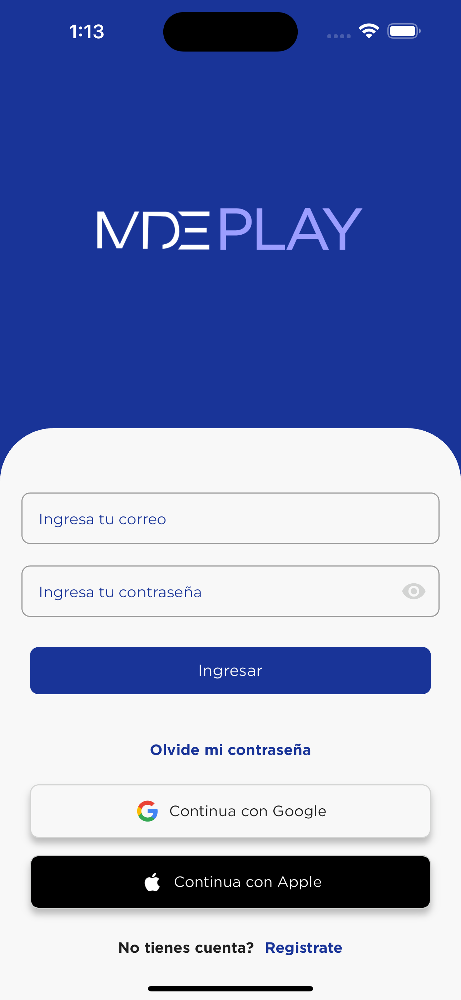
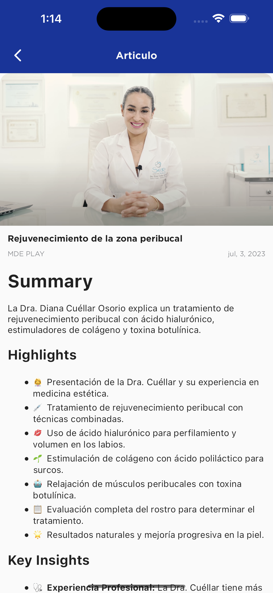
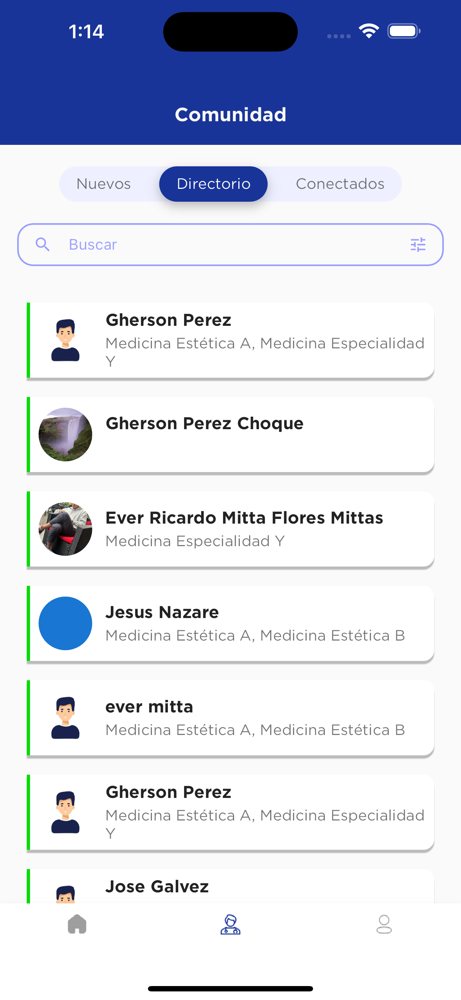

# MDE PLAY

Breve descripción del proyecto:  
   RefuerzApp es una aplicación móvil que utiliza inteligencia artificial para analizar fotos, planos u otra información estructural proporcionada por el usuario, ofreciendo soluciones precisas y asistencia personalizada a través de agentes especializados.

## 📸 Capturas de Pantalla

## 🛠️ Tecnologías Usadas
- Flutter
- Firebase (si aplica)
- API REST personalizada

## 🤝 Contribuciones
- **Diseño UX/UI**: Propio o con colaboración.
- **Integración con API**: [Desarrollador Backend o propio].
